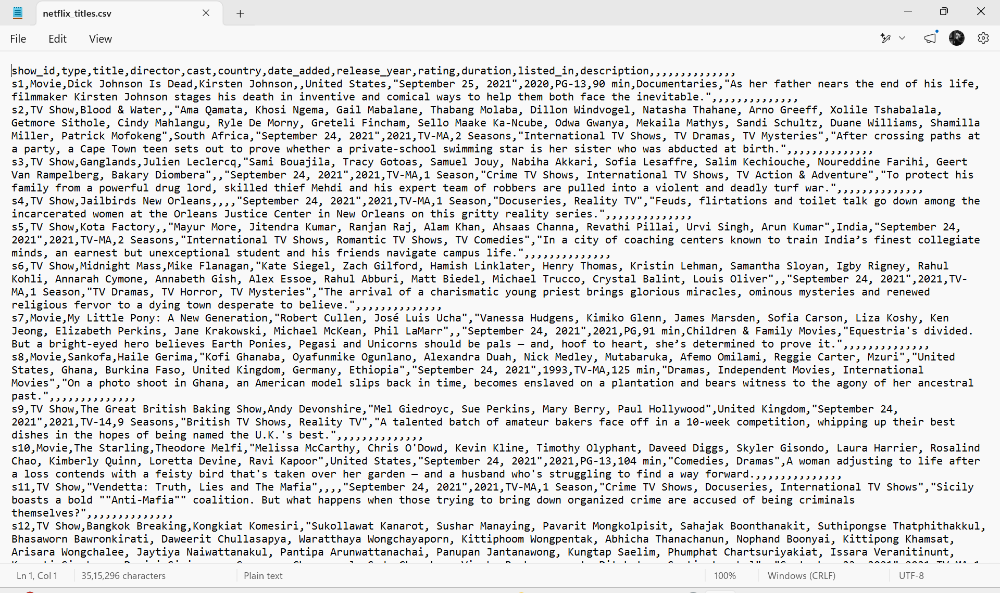
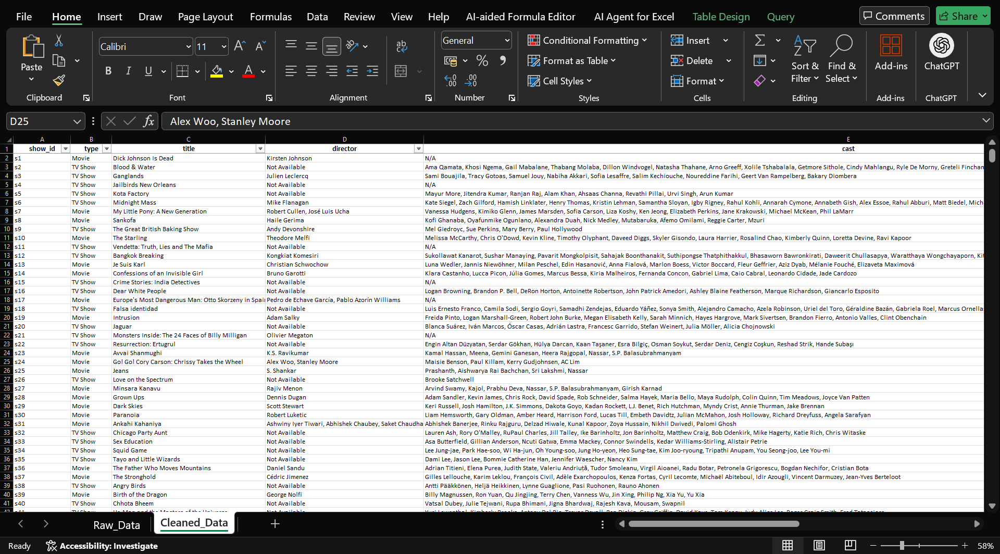

# Task 1: Data Cleaning and Preprocessing – Netflix Dataset

## 📌 Project Overview

This project was completed as part of the **DataX Labs Data Analytics Internship**. The objective was to clean and preprocess the Netflix dataset to improve data quality and prepare it for further analysis and visualization.

---

## 🎯 Objective

The goal of this task was to:

* Identify and handle missing values
* Remove duplicate records
* Standardize data formats
* Verify and correct data types
* Ensure column naming consistency
* Remove unnecessary columns
* Create a clean dataset ready for analysis

---

## 📊 Dataset Information

**Dataset:** Netflix Titles Dataset

The dataset contains information about Netflix Movies and TV Shows, including:

* Show ID
* Type
* Title
* Director
* Cast
* Country
* Date Added
* Release Year
* Rating
* Duration
* Listed In (Genre)
* Description

---

## 🛠️ Data Cleaning Steps Performed

### 1. Missing Value Handling

* Identified missing values across multiple columns.
* Replaced missing values with appropriate placeholders such as:

  * N/A
  * Not Available

### 2. Duplicate Removal

* Checked the dataset for duplicate records.
* Removed duplicate rows to ensure data accuracy.

### 3. Date Format Standardization

* Standardized the `date_added` column into a consistent format:

  * `dd-mm-yyyy`

### 4. Data Type Verification

Verified appropriate data types for:

* `date_added` → Date
* `release_year` → Number
* Remaining columns → Text

### 5. Column Name Validation

Verified that column headers already followed a clean naming convention:

* Lowercase letters
* Underscore separators
* No unnecessary spaces

### 6. Dataset Cleanup

* Removed unnecessary empty columns.
* Created a cleaned dataset while preserving the original dataset separately.

---

## 📝 Short Summary of Changes

* Identified and handled missing values by replacing blank entries with appropriate values such as "N/A" and "Not Available".
* Removed duplicate records from the dataset.
* Standardized the `date_added` column into a consistent date format (`dd-mm-yyyy`).
* Verified and corrected data types where necessary.
* Verified that column names followed a consistent naming convention.
* Removed unnecessary empty columns from the dataset.
* Created a cleaned and analysis-ready version of the Netflix dataset.

---

## 🧰 Tools Used

* Microsoft Excel

---

## 📂 Files Included

* `netflix_titles.csv` – Original Dataset
* `Task-1-Data-Cleaning-Netflix.xlsx` – Cleaned Dataset
* `raw_data.png` – Original Dataset Screenshot
* `cleaned_data.png` – Cleaned Dataset Screenshot
* `README.md` – Project Documentation

---

## 📸 Screenshots

### Raw Dataset

### Cleaned Dataset

---

## ✅ Outcome

Successfully cleaned and preprocessed the Netflix dataset by handling missing values, removing duplicates, standardizing date formats, validating data types, and removing unnecessary columns. The final dataset is clean, consistent, and ready for further analysis.

---

## 👩‍💻 Author

**Kapa Sri Lakshmi**

B.Tech – Computer Science and Engineering
Mohan Babu University
Aspiring Data Analyst
